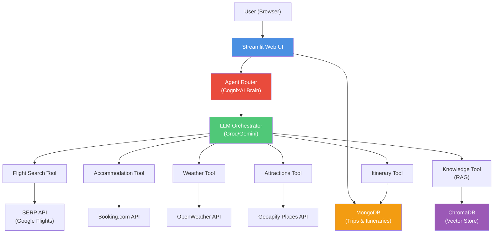

# AI Tour Guide 🌍✈️


## 📋 Overview

**AI Tour Guide** is a full-stack, AI-powered travel planning platform that assists users across the **entire travel lifecycle** — from destination discovery to itinerary planning, real-time assistance during trips, and expense tracking.

The system combines:
- **Streamlit-based frontend** for intuitive user interaction
- **Multi-agent LLM orchestration** for intelligent decision-making
- **Real-time external APIs** for live travel data
- **RAG (Retrieval-Augmented Generation)** for grounded, factual answers
- **MongoDB** for persistent, multi-session memory

The project is designed as a **modular, agent-driven system**, not a single chatbot — ensuring scalability, maintainability, and clear separation of concerns.

---

## ✨ Key Features

### 🔍 Destination Exploration
- Theme-based and activity-based place discovery
- Gemini and Llama-powered intelligent recommendations
- MongoDB caching to optimize performance and reduce LLM calls

### 🗓️ AI-Driven Trip Planning
- Conversational itinerary creation through natural language
- Multi-day itinerary editing and refinement
- Draft vs finalized plan separation for safer workflows
- Automated date/time normalization and sorting

### 🤖 Multi-Agent System (Cognix AI)
Each responsibility is handled by a **specialized agent**:
- **Itinerary Agent** – stores, updates, and finalizes travel plans
- **Attractions Agent** – curates top attractions using Geoapify data
- **Weather Agent** – transforms raw weather data into actionable travel advice
- **Hotel Agent** – filters and ranks accommodation options
- **RAG Agent** – answers food, dining, and local culture queries using Wikivoyage knowledge

A central **CognixAI orchestrator** performs:
- Intent detection and classification
- Dynamic tool selection and routing
- Response synthesis and generation
- Memory management and updates

### 📚 Retrieval-Augmented Generation (RAG)
- Wikivoyage travel data ingested and processed
- Embedded using `sentence-transformers` for semantic search
- Stored in ChromaDB for fast vector retrieval
- Context-aware routing to minimize unnecessary queries

### 🧳 Ongoing Trip Assistant
- Real-time weather insights for your destination
- Nearby attractions and points of interest
- Expense logging with automatic categorization
- To-do tracking per destination

### 💾 Persistent Memory
- MongoDB-backed user sessions for continuity
- Saved trips and itineraries across devices
- Ongoing trip state management
- Complete expense history and analytics

---

## 🏗️ Architecture

### System Flow Diagram



### Component Breakdown

**Frontend Layer**
- Streamlit UI with multi-page navigation
- Session state management
- Real-time user interaction

**AI Orchestration Layer**
- CognixAI brain for intent detection
- Dynamic tool routing based on context
- Draft vs final itinerary lifecycle control

**Agent Layer (Specialized Tools)**
- Modular, single-responsibility agents
- Independent testing and maintenance
- Clear API contracts

**Data Layer**
- MongoDB for structured persistence
- ChromaDB for semantic search
- Caching layer for performance optimization

**External Integration Layer**
- OpenWeather for real-time weather data
- Geoapify for places and attractions
- SerpAPI for flight search
- Booking.com for accommodations

---

## 🛠️ Tech Stack

### Frontend
- **Streamlit** - Interactive web interface

### Backend / AI
- **Python 3.10+** - Core language
- **LangChain** - LLM orchestration framework
- **Groq** - Fast inference (Llama-3.1-8B)
- **Google Gemini** - Destination recommendations

### Databases
- **MongoDB** - Primary data persistence
- **ChromaDB** - Vector store for RAG

### External APIs
- **OpenWeather API** - Weather data
- **Geoapify Places API** - Attractions and POIs
- **SerpAPI** - Google Flights integration
- **Booking.com API** (via RapidAPI) - Hotel search

### Libraries
- `sentence-transformers` - Text embeddings
- `pymongo` - MongoDB driver
- `chromadb` - Vector database
- `python-dotenv` - Environment management

---

## 🚀 Getting Started

### Prerequisites

- Python 3.10 or higher
- MongoDB (local installation or cloud URI)
- API Keys (see configuration below)

### Installation

1. **Clone the repository**
   ```bash
   git clone https://github.com/ms-kishore03/Tour_Guide.git
   cd Tour_Guide
   ```

2. **Install dependencies**
   ```bash
   pip install -r requirements.txt
   ```

3. **Set up environment variables**
   
   Create a `.env` file in the root directory:
   ```env
   GROQ_API_KEY=your_groq_api_key
   GEMINI_API_KEY=your_gemini_api_key
   Accomodation_API_KEY=your_rapid_api_key
   MONGODB_URI=your_mongodb_connection_string
   OpenWeatherMap_API_Key=your_openweather_key
   GEOAPIFY_API_KEY=your_geoapify_key
   SERPAPI_API_KEY=your_serpapi_key
   ```

4. **Build the RAG vector index** (one-time setup)
   ```bash
   python cognix_ai/src/embeddings/build_index.py
   ```

5. **Run the application**
   ```bash
   streamlit run trip_planner/Login_Register.py
   ```

6. **Access the application**
   
   Open your browser and navigate to `http://localhost:8501`

---

## 📁 Project Structure

```
Tour_Guide/
├── trip_planner/           # Streamlit UI pages
│   ├── Login_Register.py   # Entry point
│   ├── Explore.py          # Destination discovery
│   ├── Planner.py          # Trip planning interface
│   └── Trip.py             # Ongoing trip management
├── cognix_ai/              # Agent brain and tools
│   ├── agent_brain.py      # Central orchestrator
│   ├── tools/              # Specialized agents
│   └── src/embeddings/     # RAG pipeline
├── API_Handlers/           # External API integrations
├── Utilities/              # Database, auth, helpers
├── vectorstore/            # ChromaDB storage
├── config/                 # Configuration files
├── requirements.txt
├── Dockerfile
└── README.md
```

---

## 🐳 Deployment

The application is fully containerized using **Docker** and deployed on **Render**.

**Live Demo:** `https://tour-guide-ph2i.onrender.com`

---

## 🎯 Design Decisions

| Decision | Rationale |
|----------|-----------|
| **Draft vs Final Itinerary** | LLM suggestions are never authoritative until normalized and explicitly saved by the user |
| **Agent Isolation** | Each tool has a single responsibility, enabling independent testing and maintenance |
| **RAG Only When Needed** | Context-aware routing prevents unnecessary vector queries and reduces latency |
| **MongoDB as Memory Layer** | Enables multi-session continuity and rich query capabilities |
| **UI-Safe Helpers** | Ensures consistent return types for Streamlit to prevent runtime errors |

---

## ⚠️ Current Limitations

- ⏱️ Synchronous API calls (no async implementation yet)
- 📊 No centralized logging/observability framework
- 🧪 Minimal automated test coverage
- 🔐 Secrets managed via `.env` only (not production-ready secret management)
- 👥 No role-based access control (RBAC)

---

## 🤝 Contributing

Contributions are welcome! Please feel free to submit a Pull Request.

---

## 📧Support

For support, suggestions or code related errors [raise an issue](https://github.com/ms-kishore03/Tour_Guide/issues).

---

<p align="center">Made with ❤️ for travelers worldwide</p>